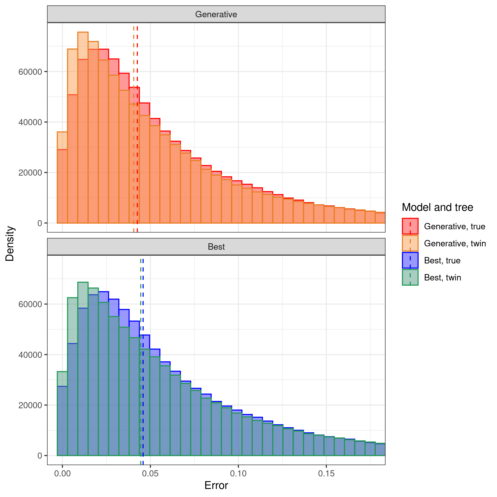

# pirouette_example_34

Branch   |[](https://travis-ci.org)                                                                                                 |[](https://appveyor.com)                                                                                               
---------|--------------------------------------------------------------------------------------------------------------------------------------------------------------|---------------------------------------------------------------------------------------------------------------------------------------------------------------------------------------------
`master` |[](https://travis-ci.org/richelbilderbeek/pirouette_example_34) |[](https://ci.appveyor.com/project/richelbilderbeek/pirouette-example-34/branch/master)
`develop`|[](https://travis-ci.org/richelbilderbeek/pirouette_example_34)|[](https://ci.appveyor.com/project/richelbilderbeek/pirouette-example-34/branch/develop)

A [pirouette example](https://github.com/richelbilderbeek/pirouette_examples)
that shows the pirouette plot for multiple DD trees.

This figure is to be used for the pirouette article.

## Running on Peregrine

Install `pirouette` using the [peregrine](https://github.com/richelbilderbeek/peregrine)
bash and R scripts.

Then, in the main folder of this repo, type:

```
sbatch scripts/rerun.sh
```

## Related settings

 * [DNA alignent of 1k nucleotides (instead of 2k)](https://github.com/richelbilderbeek/pirouette_example_28)
 * [DNA alignent of 500 nucleotides (instead of 2k)](https://github.com/richelbilderbeek/pirouette_example_19)

## Results

 * Download the intermediate data at 
   [https://www.richelbilderbeek.nl/pirouette_example_34.zip](https://www.richelbilderbeek.nl/pirouette_example_34.zip)



